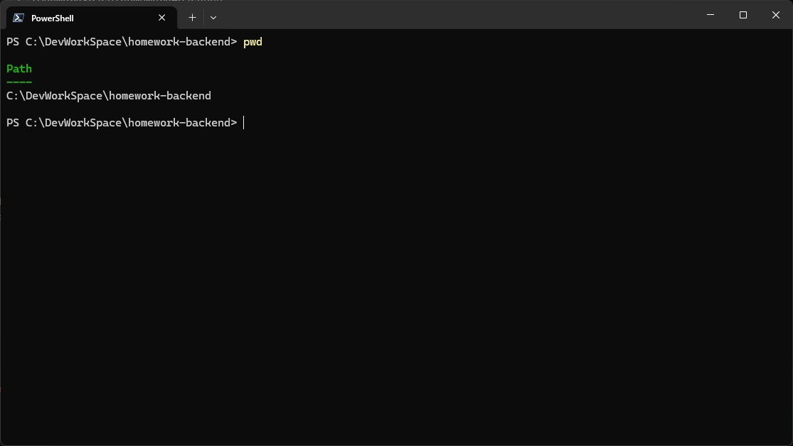
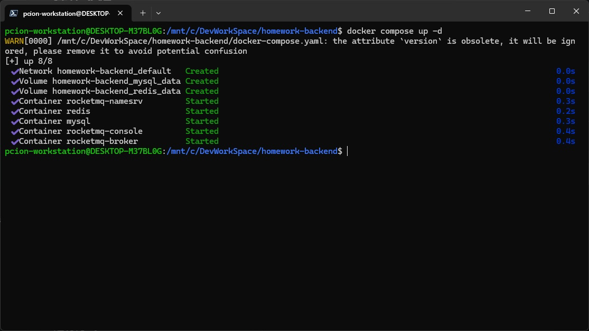
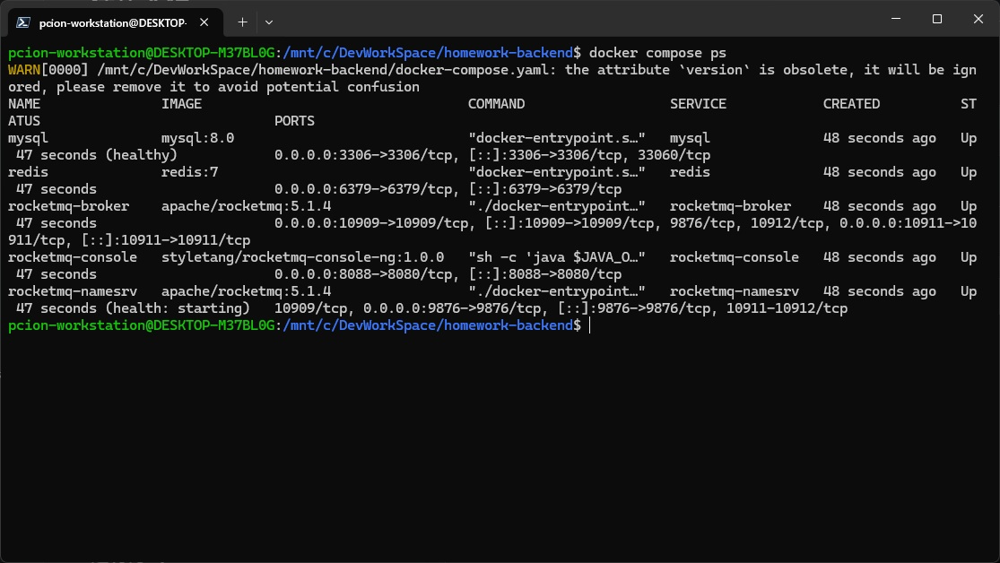
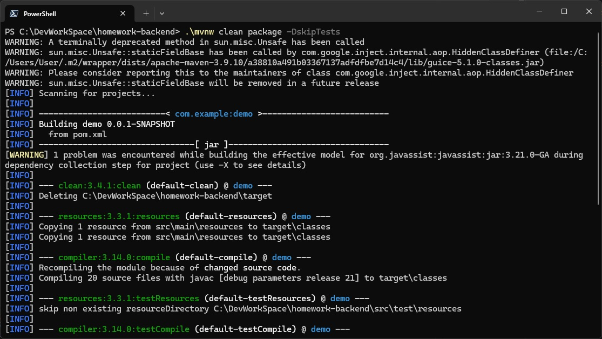
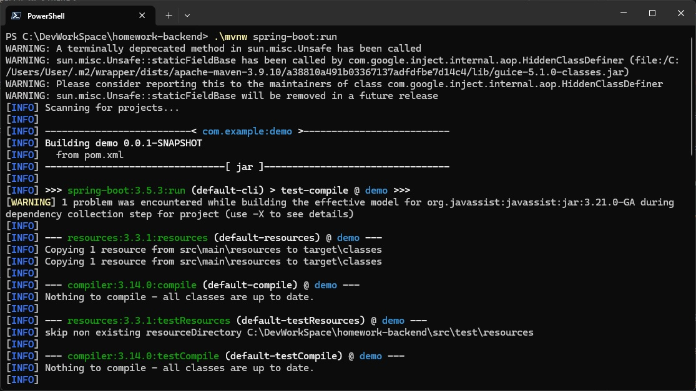
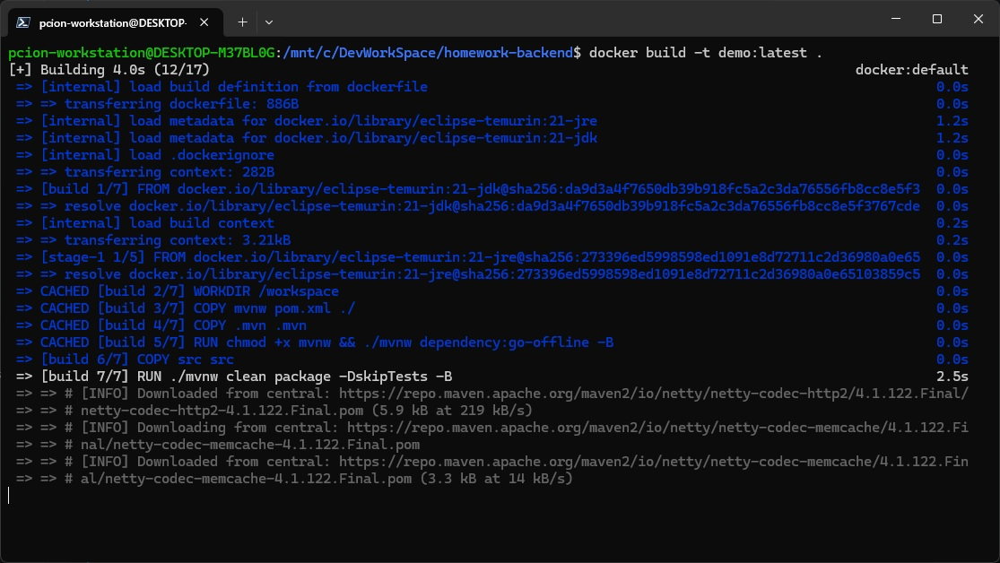
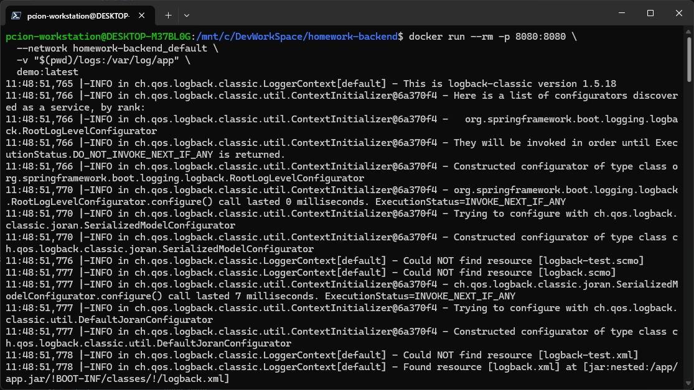

# 操作文檔

以下命令都需要在專案根目錄底下執行，也就是包含 `pom.xml`、`docker-compose.yaml`、`dockerfile` 的目錄。

例如目前是在 `C:\DevWorkSpace\homework-backend` 底下開發，執行命令前請先確認終端機路徑位於此目錄：

```powershell
pwd
```



## 啟動依賴服務

執行應用程式前，需要先啟動 Docker Compose 內的 MySQL、Redis、RocketMQ 等服務：

```powershell
docker compose up -d
```



確認服務啟動狀態：

```powershell
docker compose ps
```



## 打包方式

```powershell
.\mvnw clean package -DskipTests
```



## 運行方式 - Windows

```powershell
.\mvnw spring-boot:run
```



## Docker 打包方式

```powershell
docker build -t demo:latest .
```



## 運行方式 - Docker

```powershell
docker run --rm -p 8080:8080 \
  --network homework-backend_default \
  -v "${PWD}/logs:/var/log/app" \
  demo:latest
```

